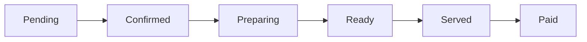

# Order Management

POS AI provides complete order lifecycle management for restaurants.

## Order Status Flow

## Order Statuses

| Status | Description |
|--------|-------------|
| **Pending** | Order just created, awaiting confirmation |
| **Confirmed** | Staff confirmed the order |
| **Preparing** | Kitchen is preparing the order |
| **Ready** | Order is ready for serving |
| **Served** | Food delivered to customer |
| **Paid** | Payment completed |

## Managing Orders

### Create New Order

1. Click **New Order**
2. Select table (for table service) or continue (counter service)
3. Add menu items
4. Adjust quantities as needed
5. Add special instructions if any

### Update Order Status

1. Find the order in the queue
2. Click the status badge
3. Select the next status

### View Order Details

Click on any order to see:
- Order items
- Order history
- Payment status
- Customer notes

## Order Actions

| Action | Description |
|--------|-------------|
| Edit | Modify order items |
| Cancel | Cancel the order |
| Split Bill | Divide among multiple payers |
| Print | Reprint receipt |

## Split Bill Feature

Split bills among multiple customers:

1. Select order
2. Click **Split Bill**
3. Choose split method:
   - **Equal Split** - Divide equally
   - **By Item** - Assign items to each person
   - **Custom** - Enter custom amounts
4. Assign payment methods to each split
5. Process payments

## Order Queue

The order queue shows all active orders organized by status:

- **Pending Orders** - Need confirmation
- **In Progress** - Being prepared
- **Ready Orders** - Awaiting pickup/delivery

## Kitchen Display System (KDS)

Orders automatically appear on the kitchen display for preparation tracking.

## Need Help?

[View FAQs](/troubleshooting/faqs) or contact support.
