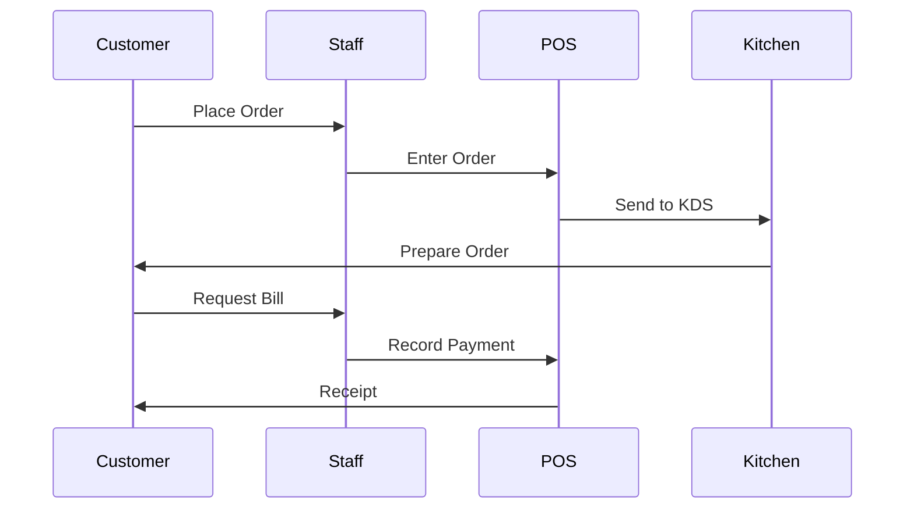

# Welcome to IDEAZES POS AI

IDEAZES POS AI is a comprehensive restaurant management system designed to streamline your operations, from order taking to billing and customer management.

## Key Features

- **Order Management** - Track orders from pending to served
- **Receipt Printing** - Multiple printer options (Browser, Network, Bluetooth)
- **Subscription Plans** - Flexible pricing for restaurants of all sizes
- **Kitchen Display** - Real-time order tracking for kitchen staff
- **Table Management** - Organize seating and reservations

## How It Works

## Order Flow

| Status | Description |
|--------|-------------|
| Pending | Order received, awaiting confirmation |
| Confirmed | Order confirmed by staff |
| Preparing | Kitchen is preparing the order |
| Ready | Order ready for serving |
| Served | Food delivered to customer |
| Paid | Payment completed |

## Getting Started

1. [Set up your outlet](/getting-started/setup-outlet)
2. [Configure receipt printer](/features/receipt-printing)
3. [Start taking orders](/getting-started/quickstart)

## Need Help?

- [View FAQs](/troubleshooting/faqs)
- [Contact Support](mailto:support@ideazes.com)
